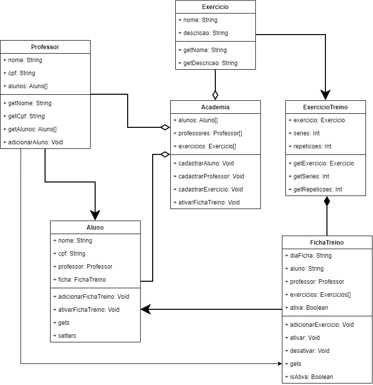

# Sistema de Academia

## 1. Descrição do problema

O projeto consiste no desenvolvimento de um sistema para gerenciamento de uma academia, utilizando Programação Orientada a Objetos.

O sistema busca representar os principais elementos envolvidos na elaboração e no acompanhamento de treinos, como alunos, professores, exercícios e fichas de treino. Dessa forma, é possível estabelecer relacionamentos entre esses elementos e organizar as informações de maneira estruturada.

## 2. Objetivo do sistema

O objetivo do sistema é permitir o gerenciamento de alunos, professores e exercícios, possibilitando também a criação e o gerenciamento de fichas de treino.

O projeto tem como finalidade aplicar conceitos de Programação Orientada a Objetos, principalmente:

* criação e utilização de classes e objetos;
* encapsulamento de atributos;
* relacionamentos entre objetos;
* organização das responsabilidades entre as classes;
* implementação de regras de negócio;
* utilização de recursos de depuração;
* utilização de recursividade de forma coerente com o problema.

## 3. Descrição das funcionalidades

O sistema possui as seguintes funcionalidades principais:

* Cadastro de alunos;
* Cadastro de professores;
* Cadastro de exercícios;
* Listagem de alunos;
* Listagem de professores;
* Listagem de exercícios;
* Criação de fichas de treino;
* Adição de exercícios às fichas de treino;
* Definição da quantidade de séries e repetições de cada exercício;
* Associação de um professor responsável a um aluno;
* Ativação e desativação de fichas de treino;
* Consulta das fichas de treino;
* Utilização de dados de teste para facilitar a execução e validação do sistema.

As operações são disponibilizadas por meio de um menu executado no terminal.

## 4. Descrição das classes

### 4.1 Academia

A classe `Academia` é responsável pelo gerenciamento dos principais objetos do sistema.

Ela mantém listas de alunos, professores e exercícios:

* `List<Aluno> alunos`;
* `List<Professor> professores`;
* `List<Exercicio> exercicios`.

Entre seus principais métodos estão:

* `adicionarAluno()`;
* `adicionarProfessor()`;
* `adicionarExercicio()`;
* `getAlunos()`;
* `getProfessores()`;
* `getExercicios()`;
* `cadastrarAluno()`;
* `cadastrarProfessor()`;
* `cadastrarExercicio()`;
* `criarFichaTreino()`;
* `ativarFichaTreino()`.

### 4.2 Aluno

A classe `Aluno` representa um aluno cadastrado na academia.

Seus principais atributos são:

* `nome`;
* `cpf`;
* `professorResponsavel`;
* `fichasTreino`.

A classe possui métodos para consultar seus dados, definir o professor responsável e adicionar fichas de treino.

Principais métodos:

* `getNome()`;
* `getCpf()`;
* `getProfessorResponsavel()`;
* `setProfessorResponsavel()`;
* `getFichasTreino()`;
* `adicionarFichaTreino()`;
* `ativarFichaTreino()`.

### 4.3 Professor

A classe `Professor` representa um professor da academia.

Seus atributos são:

* `nome`;
* `cpf`;
* `alunos`.

A lista de alunos representa os alunos que estão sob responsabilidade do professor.

Principais métodos:

* `getNome()`;
* `getCpf()`;
* `getAlunos()`;
* `adicionarAluno()`.

### 4.4 Exercicio

A classe `Exercicio` representa um exercício disponível na academia.

Possui os atributos:

* `nome`;
* `descricao`.

Seus principais métodos são:

* `getNome()`;
* `getDescricao()`.

### 4.5 ExercicioTreino

A classe `ExercicioTreino` representa um exercício inserido especificamente em uma ficha de treino.

Ela possui:

* `exercicio`;
* `series`;
* `repeticoes`.

Essa classe permite relacionar um exercício cadastrado à quantidade de séries e repetições que deverão ser realizadas no treino.

Principais métodos:

* `getExercicio()`;
* `getSeries()`;
* `getRepeticoes()`.

### 4.6 FichaTreino

A classe `FichaTreino` representa uma ficha de treino de um aluno.

Seus atributos são:

* `diaFicha`;
* `aluno`;
* `professor`;
* `exercicios`;
* `ativa`.

A ficha mantém uma lista de objetos `ExercicioTreino`, permitindo que cada exercício possua suas próprias séries e repetições.

Principais métodos:

* `getDia()`;
* `getAluno()`;
* `getProfessor()`;
* `getExercicios()`;
* `isAtiva()`;
* `adicionarExercicio()`;
* `ativar()`;
* `desativar()`.

### 5. Relacionamentos entre as classes

O sistema utiliza diferentes tipos de relacionamentos entre suas classes. A classe `Academia` mantém coleções de alunos, professores e exercícios, caracterizando relacionamentos de agregação. A relação entre `Professor` e `Aluno` é uma associação, na qual um professor pode ser responsável por vários alunos.

Um `Aluno` pode possuir várias `FichaTreino`, e cada ficha está associada a um `Professor`. A relação entre `FichaTreino` e `ExercicioTreino` é de composição, pois os exercícios de treino representam elementos pertencentes à ficha. Por fim, `ExercicioTreino` possui uma associação com `Exercicio`, que representa o exercício cadastrado no sistema.

As cardinalidades utilizadas são:

* `Academia` 1 → 0..* `Aluno` — agregação;
* `Academia` 1 → 0..* `Professor` — agregação;
* `Academia` 1 → 0..* `Exercicio` — agregação;
* `Professor` 1 → 0..* `Aluno` — associação;
* `Aluno` 1 → 0..* `FichaTreino` — associação;
* `Professor` 1 → 0..* `FichaTreino` — associação;
* `FichaTreino` 1 → 0..* `ExercicioTreino` — composição;
* `ExercicioTreino` 1 → 1 `Exercicio` — associação.

## Diagrama de Entidade-Relacionamento (DER) 

## 6. Regras de negócio

O sistema possui regras para representar o funcionamento básico de uma academia.

Entre as principais regras estão:

* Um aluno pode possuir um professor responsável;
* Um professor pode ser responsável por vários alunos;
* Um aluno pode possuir várias fichas de treino;
* Uma ficha de treino pertence a um aluno específico;
* Uma ficha de treino possui um professor responsável;
* Uma ficha de treino pode conter vários exercícios;
* Cada exercício de uma ficha possui uma quantidade definida de séries e repetições;
* Uma ficha de treino pode estar ativa ou desativada;
* Os atributos das classes são privados, sendo acessados por meio de métodos apropriados.

Essas regras permitem que os objetos mantenham informações relacionadas de forma coerente e evitam que os dados sejam acessados diretamente de maneira indiscriminada.

## 7. Dificuldades encontradas durante o desenvolvimento

Durante o desenvolvimento do projeto, uma das principais dificuldades foi organizar as responsabilidades entre as diferentes classes e definir quais informações deveriam pertencer a cada objeto.

Também foi necessário estabelecer corretamente os relacionamentos entre `Aluno`, `Professor`, `FichaTreino`, `ExercicioTreino` e `Exercicio`, de forma que os objetos pudessem interagir sem concentrar todas as responsabilidades em uma única classe.

Outra dificuldade foi trabalhar com listas de objetos e realizar operações de cadastro, consulta e associação entre eles.

Durante os testes, foram utilizados recursos de depuração (`debug`) para acompanhar a execução do programa, identificar erros e verificar o comportamento dos objetos e de seus relacionamentos.

Erros de compilação:
Ao utilizar o package nos arquivos do projeto, o java acusou o erro "main.java:1: error: compact source file should not have package declaration", não sendo necessária a utilização desse comando na versão do JAVA25.

A utilização da recursividade também exigiu atenção para que ela fosse aplicada de maneira adequada ao problema proposto, evitando uma implementação artificial apenas para atender ao requisito do projeto.
